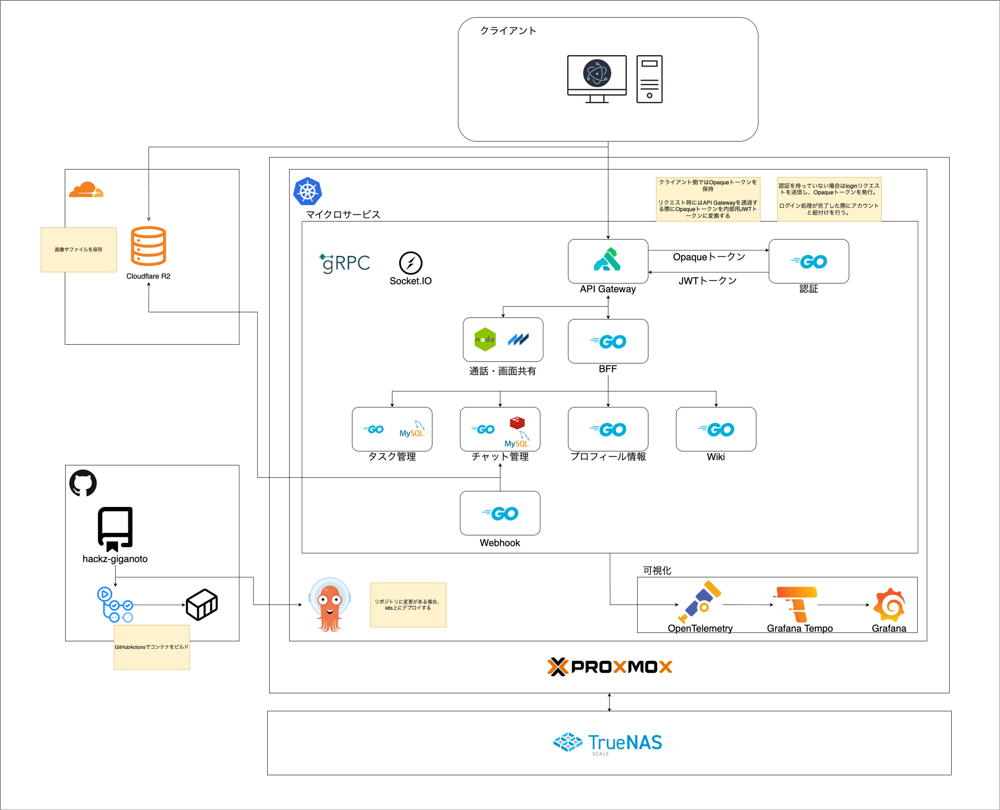

# [Hackz Giganoto Cup](https://hackz-community.doorkeeper.jp/events/184015) 🏆
本リポジトリは株式会社ハックツ様主催のハッカソンにて使用するリポジトリです。

<p align="center">
    -1f5cbf.svg?&style=for-the-badge">
    
</p>

## メンバー 🐙
<a href="https://github.com/naoido" rel="noopener noreferrer" target="_blank">
  
</a>
<a href="https://github.com/thirdlf03" rel="noopener noreferrer" target="_blank">
  
</a>
<a href="https://github.com/kenta-afk" rel="noopener noreferrer" target="_blank">
  
</a>
<a href="https://github.com/kyiku" rel="noopener noreferrer" target="_blank">
  
</a>

## 使用技術
<p align="center">
   
</p>

## 構成図 📈


## 開発Wiki ✨
### マイクロサービスを生やす 🌱
1. `microservices/${サービス名}`でディレクトリを作成する
2. `cd microservices/${サービス名}`でディレクトリに移動する
3. `go modo init object-t.com/hackz-giganoto/microservices/${サービス名}`でモジュールを作成する
4. `go get goa.design/goa/v3/...`でGoaをインストールする
5. プロジェクトルートに戻って `go work use microservices/${サービス名}`を実行する
6. `microservices/${サービス名}/design.go`を作成し、デザインを記述する
7. `make gen-${サービス名}`を実行する
    - 内部でgoa genを実行します
8. そして`make example-${サービス名}`を実行する
    - 内部でgoa exampleを実行します
9. `docker-compose.yaml`に作成したマイクロサービスを追記します。
10. `docker compose build ${サービス名}`を実行しビルドする
11. `docker compose up`で起動する

### ディレクトリ構造 📁
```sh
.
├── build # ビルド用のファイル置き場
├── gateway # Kong Gatewayの設定関連
│   └── plugins
│       └── token-transformer # Opaqueトークンを内部JWTトークンに変換するためのプラグイン
├── manifests # k8sデプロイ用のマニフェストを格納するディレクトリ
├── microservices # マイクロサービスを格納するディレクトリ
│   ├── auth # 認証サービス
│   │   ├── cmd
│   │   │   ├── auth
│   │   │   └── auth-cli
│   │   ├── design
│   │   └── gen # make gen-authで生成されたディレクトリ
│   │       ├── auth
│   │       └── http
│   │           ├── auth
│   │           │   ├── client
│   │           │   └── server
│   │           └── cli
│   │               └── auth
│   └── bff # BFFを記述するためのディレクトリ
│       └── design
└── pkg # マイクロサービス間で共通定義を行うディレクトリ
    ├── redis # Redis関連
    └── security # セキュリティ系
```